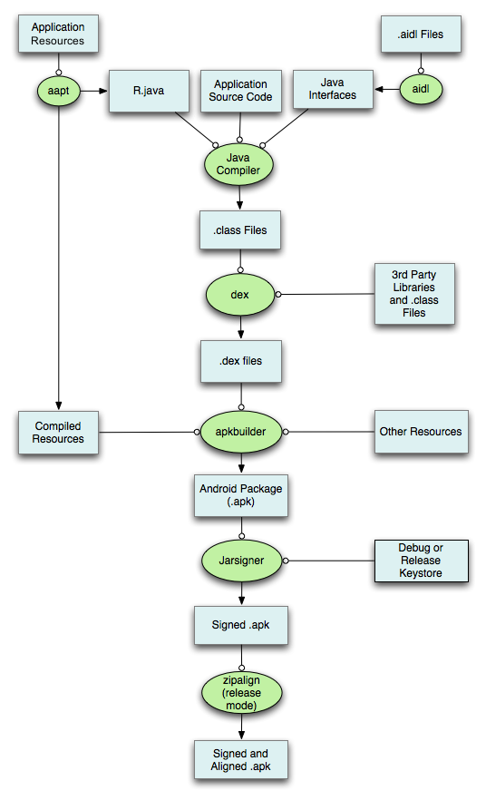

[TOC]
### 打包的流程:

#### 1. 通过aapt打包res资源文件,生成R.java,resources.arsc和res文件

#### 2. 处理aidl文件,生成对应的Java接口文件
#### 3. 通过javac编译R.java,java文件,java源文件,生成.class文件
#### 4. 通过dx命令,将.class文件和第三方库中.class生成classes.dex
#### 5. 通过apkbuilder工具,将aapt生成的resources.arsc和res文件,assets文件和classes.dex打包生成apk

#### 6. 通过Jarsigner工具,将上面的apk进行debug或release签名
#### 7. 通过zipalign工具,将签名后的apk进行对齐处理

对齐的作用就是减少运行时内存的使用
- 如果使用apksigner,zipalign只能在签署APK文件之前执行
- 如果使用jarsigner,zipalign只能在APK文件签名之后才能执行.

在系统中,会有多个进程访问apk中的资源文件,安装器读权限,桌面应用读启动图标和应用名,系统服务读取资源(notification需要读取图标).如果不进行zipalign,这些个访问就会消耗更多内存和变得更慢.

### 扩展
具体每一步的命令参考[Android APK 编译打包流程](https://segmentfault.com/a/1190000008071324)

代码级别分析[Android应用程序资源的编译和打包过程分析](http://blog.csdn.net/luoshengyang/article/details/8744683)

参考:
- [zipalign](https://developer.android.com/studio/command-line/zipalign.html) zipalign使用
- [Android APK打包流程](http://shinelw.com/2016/04/27/android-make-apk/)
- [Zipalign: an Easy Optimization](http://tool.oschina.net/uploads/apidocs/android/resources/articles/zipalign.html) 阐述zipalign优化的原因

