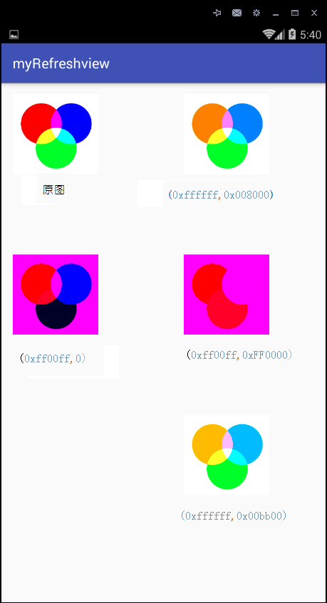
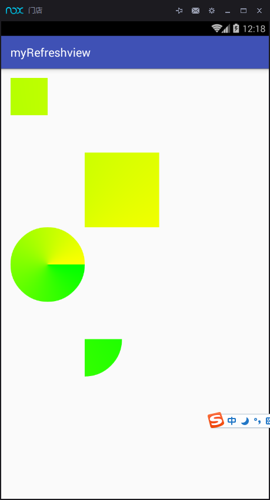
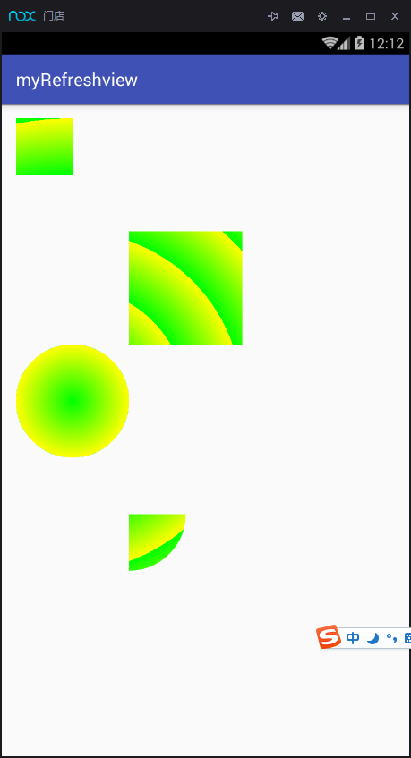

[TOC]
####ColorFilter
#####1.LightingColorFilter
**这个Filter一般用来用作点击效果颜色的制作,对bitmap的颜色进行改变.**
构造函数的两个参数(colorMultiply,colorAdd),经过的运算如下:
```
R' = R * colorMultiply.R + colorAdd.R
G' = G * colorMultiply.G + colorAdd.G
B' = B * colorMultiply.B + colorAdd.B
```
从上面可看出,影响的是整个画布中所有的像素.



#####2.PorterDuffColorFilter


####Xfermode
#####AvoidXfermode
**是对canvas绘制区域上背景的颜色做操作.**</br>
AvoidXfermode在API16之后不支持硬件加速，所以提示deprecated

AvoidXfermode(int opColor, int tolerance, Mode mode)
- opColor是被操作的颜色
- tolerance是容错值,就是opColor加减tolerance作为操作的区间
- mode有AvoidXfermode.Mode.TARGET和AvoidXfermode.Mode.AVOID两种模式，前者表示对指定的opColor操作,而后者是对跟opColor不同的颜色做操作.

#####PorterDuffXfermode
[http://blog.csdn.net/tianjian4592/article/details/44783283](http://blog.csdn.net/tianjian4592/article/details/44783283)
[http://www.jianshu.com/p/d11892bbe055](http://www.jianshu.com/p/d11892bbe055)
[http://blog.csdn.net/aigestudio/article/details/41316141](http://blog.csdn.net/aigestudio/article/details/41316141)
示例:
刮刮卡的效果
loading效果
圆角图片


####PathEffect

| 类型 | 说明 |
|--------|--------|
|   CornerPathEffect(radius)   |   画的是实线, radius表示转折的弧度的半径   |
|   DashPathEffect(intervals[],phase)    |   画的是虚线, itervals数组中代表各个线段的长度,偶数位的值是虚位长度,奇数为的值是实位长度,phase表示开始的位移,会对之前数组的和进行模运算  |
|DiscretePathEffect(segmentLength,deviation)| 画的是实线,segmentLength表示发生偏移的间隔,deviation表示偏移量的最大值   |
|PathDashPathEffect(shape,advance,phase, style)| 画的是虚线,shape表示每个虚点画的path,advance表示间隔,phase表示位移,style有Rotate,Translate,morph,Rotate表示旋转90度, morph跟rotate很像(在拐角处跟圆滑) |
|  ComposePathEffect(outerpe,innerpe) | 综合两种patheffect 顺序先后会对最终效果有影响   |
|  SumPathEffect(outerpe,innerpe) | 画出两种patheffect,顺序对最终效果没有影响    |


####Shader
##### BitmapShader   
设置后效果作为背景进行绘画  对图片进行三个操作,分别为TileMode.MIRROR（倒影）TileMode.CLAMP(扭曲图片图片边缘)TileMode.REPEAT(重复)
#####  LinearGradient   线性渐变颜色,有两种构造方法:|
- LinearGradient(float x0, float y0, float x1, float y1, int color0, int color1,TileMode tile)
x0,y0表示开始的x、y坐标,而x1,y1表示结束坐标,color0表示开始颜色和color1表示结束颜色, tile表示重复的方式跟上面的模式一样
- LinearGradient(float x0, float y0, float x1, float y1, int colors[], float positions[], TileMode tile)
前四个参数一样,colors表示在渐变线中的多个颜色,而positions表示每个颜色在渐变线中的位置,可以为null表示均分

#####SweepGradient 扫描式渐变,有两种构造方法:
- SweepGradient(float cx, float cy, int color0, int color1)
  cx,cy表示这个渐变的圆心,color0和color1表示开始和结束的颜色,顺时针渐变
- SweepGradient(float cx, float cy, int colors[], float positions[])
  这个方法跟线性渐变类似,提供多个颜色和指定多个颜色的位置,positions可以为Null

#####RadialGradient 径向渐变,由圆心向外渐变,提供两种构造方法:
-  RadialGradient(float centerX, float centerY, float radius, int centerColor, int edgeColor, @NonNull TileMode tileMode)
   centerX,centerY为圆心坐标,radius表示渐变的单次半径,centerColor和edgeColor表示开始和结束颜色,tileMode同上
-  RadialGradient(float centerX, float centerY, float radius,@NonNull int colors[], @Nullable float stops[], @NonNull TileMode tileMode)
   提供多个颜色和指定多个颜色的位置,positions可以为Null



####MaskFilter
#####BlurMaskFilter


