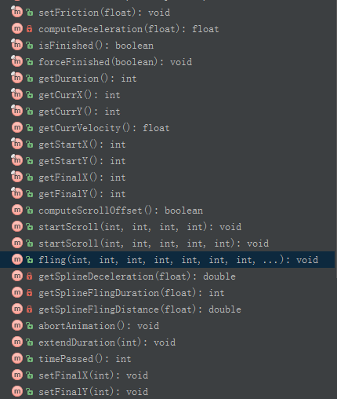
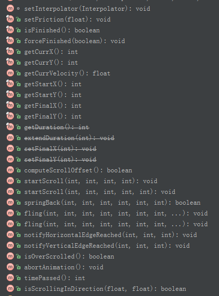
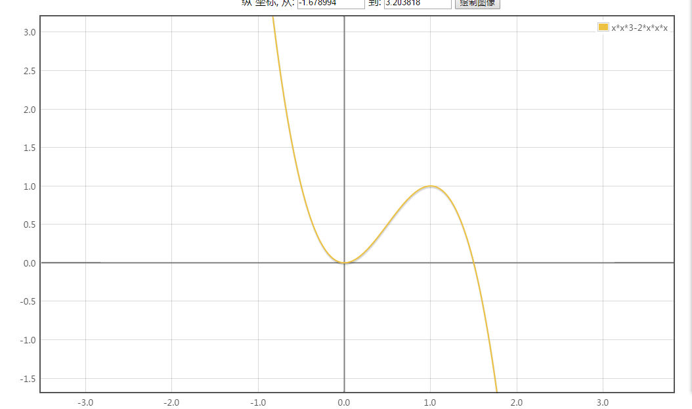

[TOC]
####Scroller

#####1.基本使用:
1.重写computeScroll方法,eg：
```
 @Override
    public void computeScroll() {
        if(mScroller.computeScrollOffset()){
            scrollTo(mScroller.getCurrX(),mScroller.getCurrY());
            invalidate();
        }
    }
```
2.调用滑动方法.
```
startScroll(startX,startY,dx,dy);
invalidate();
```

#####2.startScroll(startX, startY, dx,dy)和startScroll(startX, startY, dx,dy,duration) 
startX/startY 当前View的偏移位移 
dx/dy 滚动/滑动的距离,负值表示向坐标系的正向移动,相反就是向坐标系的反向移动
重载方法多了duration参数,指定滑动/滚动的时间,默认是250ms

#####3.fling(startX, startY, velocityX, velocityY,minX, maxX, minY,maxY)
startX/startY 当前View的偏移位移
velocityX/velocityY 进行fling的两个方向的速度？？？？？？
minX/minY ?????
maxX/maxY ??????


####OverScroller

#####1.基本使用跟Scroller一致

#####2.springBack
boolean springBack(startX, startY, minX, maxX, minY, maxY)
返回false表示已经在minX/maxX和minY/maxY的矩形中．
startX/startY表示开始的位置
minX/maxX和minY/maxY 定义了springBack这个动作最后要到达的Rect(方向跟屏幕坐标相反)
会让当前控件回滚到上面这个矩形的最靠近的一个顶点.

#####3.fling


####滚动/移动

值:x/y,translationX/translationY,left/top,scrollX/scrollY
x/y,left/top都是相对于父容器坐标的
x=left+translationX
y=top+translationY

操作:
- scrollTo/scrollBy
- offsetLeftAndRight/offsetTopAndBottom
- 改变LayoutParams
- 动画

1.使用scrollTo/scrollBy进行移动的时候,left和top值,x,y值都不会发生改变,改变的只有scrollX/scrollY的值.
2.使用 offsetLeftAndRight/offsetTopAndBottom 只会会改变对应left/right 或者top/Bottom,其他值是保持不变的


|  | scrollTo/scrollBy|  offsetLeftAndRight/offsetTopAndBottom | 改变LayoutParam|动画|
|--------|--------|-------|-------|-------|
|    x/y    |  不改变     |  **改变**     |		|		|
|    translationX/translationY    |  不改变      |    不改变   |		|		|
|    left/top   |   不改变     |  **改变**     |		|		|
|    scrollX/scrollY   | **改变**       |  不改变     |		|		|


#####startScroll相关代码
```
public void startScroll(int startX, int startY, int dx, int dy, int duration) {
        mMode = SCROLL_MODE;
        mFinished = false;
        mDuration = duration;
        mStartTime = AnimationUtils.currentAnimationTimeMillis();
        mStartX = startX;
        mStartY = startY;
        mFinalX = startX + dx;
        mFinalY = startY + dy;
        mDeltaX = dx;
        mDeltaY = dy;
        mDurationReciprocal = 1.0f / (float) mDuration;
    }
```

```
 if (mFinished) {
            return false;
        }

        int timePassed = (int)(AnimationUtils.currentAnimationTimeMillis() - mStartTime);
    
        if (timePassed < mDuration) {
            switch (mMode) {
            case SCROLL_MODE:
                final float x = mInterpolator.getInterpolation(timePassed * mDurationReciprocal);
                mCurrX = mStartX + Math.round(x * mDeltaX);
                mCurrY = mStartY + Math.round(x * mDeltaY);
                break;
           .....省去无关代码
          }
        }
        else {
            mCurrX = mFinalX;
            mCurrY = mFinalY;
            mFinished = true;
        }
        return true;
```


#####springBack相关代码
```
public boolean springBack(int startX, int startY, int minX, int maxX, int minY, int maxY) {
        mMode = FLING_MODE;

        // Make sure both methods are called.
        final boolean spingbackX = mScrollerX.springback(startX, minX, maxX);
        final boolean spingbackY = mScrollerY.springback(startY, minY, maxY);
        return spingbackX || spingbackY;
    }
```

```
boolean springback(int start, int min, int max) {
            mFinished = true;

            mCurrentPosition = mStart = mFinal = start;
            mVelocity = 0;

            mStartTime = AnimationUtils.currentAnimationTimeMillis();
            mDuration = 0;

            if (start < min) {//这里的判断印证了springback是滚动到最靠近minX/maxX/minY/maxY定义矩形的顶点
                startSpringback(start, min, 0);
            } else if (start > max) {
                startSpringback(start, max, 0);
            }

            return !mFinished;
        }

```
```
 private void startSpringback(int start, int end, int velocity) {
            // mStartTime has been set
            mFinished = false;
            mState = CUBIC;
            mCurrentPosition = mStart = start;
            mFinal = end;
            final int delta = start - end;//某一方向移动的距离
            mDeceleration = getDeceleration(delta); //delta>0返回-2000 delta<0返回2000
            // TODO take velocity into account
            mVelocity = -delta; // only sign is used
            mOver = Math.abs(delta);
            mDuration = (int) (1000.0 * Math.sqrt(-2.0 * delta / mDeceleration));//等价于(1000*abs(delta))开平方根,x和y轴的时间值可能有不一样的情况
        }

```

计算阶段

```
 public boolean computeScrollOffset() {
        if (isFinished()) {
            return false;
        }

        switch (mMode) {
          ......省去无关代码
            case FLING_MODE:
                if (!mScrollerX.mFinished) {
                    if (!mScrollerX.update()) {
                        if (!mScrollerX.continueWhenFinished()) {//在springBack中continueWhenFinished()直接返回false
                            mScrollerX.finish();//已经结束
                        }
                    }
                }

                if (!mScrollerY.mFinished) {
                    if (!mScrollerY.update()) {
                        if (!mScrollerY.continueWhenFinished()) {
                            mScrollerY.finish();
                        }
                    }
                }
				//从这里可以看到,spingBack跟startScroll是不一样的,startScroll是xy轴的时间跨度是一样的.而springBack是各自计算的
                break;
        }

        return true;
    }

```

```
/**
**更新当前位置和速度值,返回true表示更新成功,返回false表示滚动完成
**/
boolean update() {
            final long time = AnimationUtils.currentAnimationTimeMillis();
            final long currentTime = time - mStartTime;//经过的时间间隔

            if (currentTime == 0) {
                // Skip work but report that we're still going if we have a nonzero duration.
                return mDuration > 0;
            }
            if (currentTime > mDuration) {
                return false;
            }

            double distance = 0.0;
            switch (mState) {
                .....省去无关代码
                case CUBIC: {//springBack的状态
                    final float t = (float) (currentTime) / mDuration;
                    final float t2 = t * t;
                    final float sign = Math.signum(mVelocity);
                    distance = sign * mOver * (3.0f * t2 - 2.0f * t * t2);//计算每次刷新移动的距离 跟startScroll计算方式不一样的
                    mCurrVelocity = sign * mOver * 6.0f * (- t + t2); 
                    break;
                }
            }

            mCurrentPosition = mStart + (int) Math.round(distance);//最终getCurrentX或者getCurrentY的值

            return true;
        }
```
(3t^2^-2t^3^)*移动距离 的函数如下取值范围[0,1]



