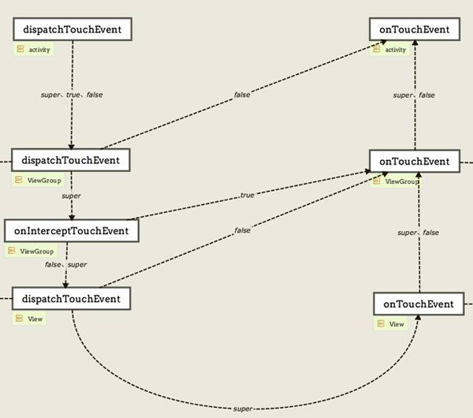
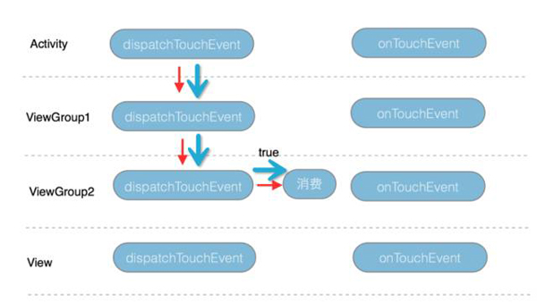
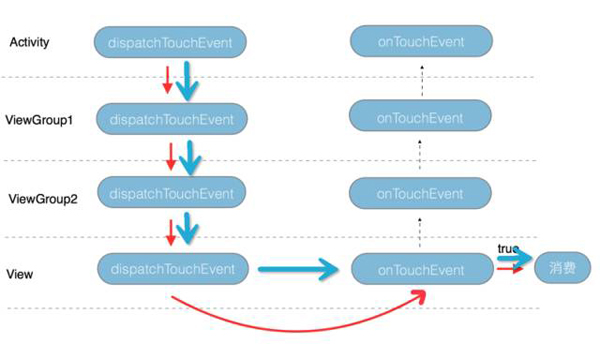
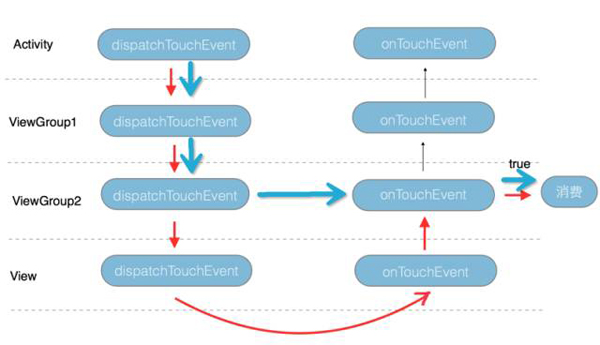
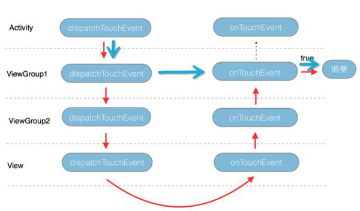
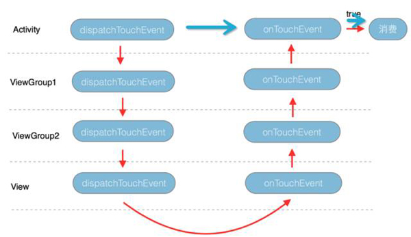
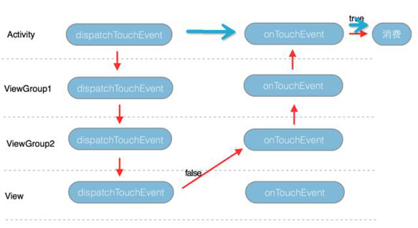
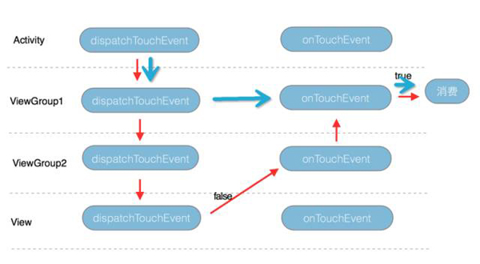
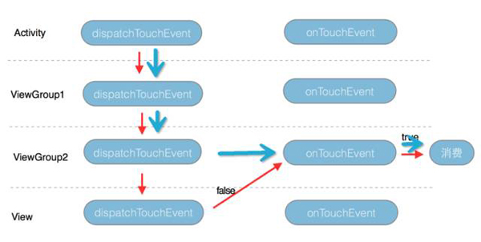
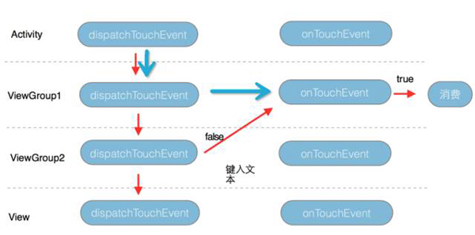

- 整个事件传递默认实现就是一个U型
- dispatchTouchEvent和onTouchEvent返回 true 的时候,事件就会终结.
- dispatchTouchEvent和onTouchEvent返回 fasle 的时候,事件都回传给父控件的onTouchEvent处理.
- onInterceptTouchEvent的作用就是返回true时,就传给自己的onTouchEvent处理.
- ViewGroup和View的dispatchTouchEvent方法的父类实现，相同的是return false 是回传到父控件的onTouchEvent,但是super的默认实现ViewGroup是调用onInterceptTouchEvent,而View是调用View自己的onTouchEvent方法.
- onTouchEvent如果不返回true,默认就是回传到父控件的onTouchEvent

#### 关于ACTION_MOVE和ACTION_UP
ACTION_DOWN事件在哪个控件消费了(return true)， 那么ACTION_MOVE和ACTION_UP就会从上往下(通过dispatchTouchEvent)做事件分发往下传，就只会传到这个控件，不会继续往下传，如果ACTION_DOWN事件是在dispatchTouchEvent消费，那么事件到此为止停止传递，如果ACTION_DOWN事件是在onTouchEvent消费的，那么会把ACTION_MOVE或ACTION_UP事件传给该控件的onTouchEvent处理并结束传递

**红色箭头表示ACTION_DOWN事件的传递,蓝色箭头表示ACTION_UP和ACTION_MOVE事件的传递**

参考:
- [图解Android事件分发机制](https://yq.aliyun.com/articles/181942)