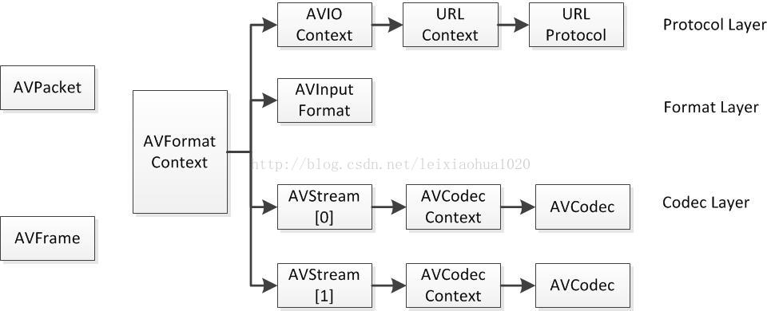

FFMPEG从功能上划分为几个模块:
- 核心工具 libutils (公用的功能函数)
- 媒体格式 libavformat (多媒体文件的读包和写包)
- 编解码 libavcodec (音视频的编解码)
- 设备 libavdevice (音视频设备的操作)
- 后处理 libavfilter libswscale libpostproc (音视频后处理)

结构体分类:
- 解协议(http,rtsp,rtmp,mms) AVIOContext,URLProtocol,URLContext主要存储音视频使用的协议类型，URLProtocol对应协议
- 解封装(flv,avi,rmvb,mp4) AVFromatContext主要存储音视频封装格式中包含的信息;AVInputFormat存储输入音视频使用的封装格式.
- 解码(h.264,mmpeg2,aac,mp3) 每个AVStream存储一个视频/音频流的相关数据,每个AVStream对应一个AVCodecContext,存储该视频或音频流使用解码方式的相关数据,每个AVCodecContext中对应一个AVCodec，包含该音频或者视频对应的解码器.
- 存数据 视频一般是一个结构一帧，而音频则是一个结构好几帧 解码前数据:AVPacket 解码后数据AVFrame




#### avcodec_decode_video2
```
int avcodec_decode_video2(AVCodecContext *avctx, AVFrame *picture,
                         int *got_picture_ptr,
                         AVPacket *avpkt);
```

- 解码视频流AVPacket,
- 使用av_read_frame读取媒体流后需要进行判断,如果是视频流则调用该函数解码
- 返回结果<0 失败
- 返回结果>=0，返回值为AVPacket int vLen,解码正常的操作:vPacket.size-=vLen;vPacket.data+=vLen
- 返回got_pictrue_ptr>0表示解码到了AVFrame *picture,然后可以对picture进程处理


#### avcodec_decode_video3

```
int avcodec_decode_audio3(AVCodecContext *avctx, int16_t *samples,
                         int *frame_size_ptr,
                         AVPacket *avpkt);
```

- 解码音频流AVPacket
- 使用av_read_frame读取媒体流之后判断,如果是音频流则调用该函数
- 返回结果<0时失败
- 返回>=0时正常,假设返回值为AVPacket int vLen,解码正常的操作:vPacket.size-=vLen;vPacket.data+=vLen
- 如果vPacket.size==0,则读取下一流包
