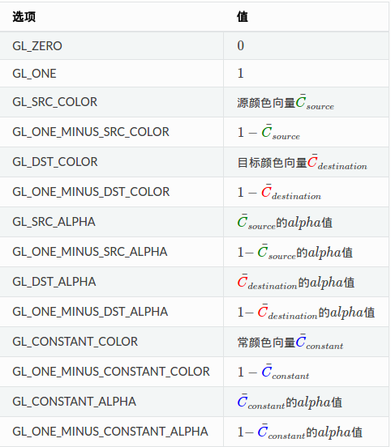

[TOC]

### ubuntu中环境的搭建
[Ubuntu 16.04 OpenGL 开发环境配置指南](http://www.jianshu.com/p/e4a90503d4a6)

安装必须的库
```
sudo apt-get install build-essential libgl1-mesa-dev
sudo apt-get install freeglut3-dev
sudo apt-get install libglew-dev libsdl2-dev libsdl2-image-dev libglm-dev libfreetype6-dev

```

GLFW的编译命令:
```
g++  hello.cpp -lGLEW -lglfw -lGL -lX11 -lpthread -lXrandr -lXi -lSOIL

```

### 图形渲染管线

图像渲染管线的各个阶段:


#### 顶点着色器
顶点坐标的转换.

#### 图元装配
将顶点装配成图元的形状

#### 几何着色器

#### 光栅化阶段
将图元映射为最终屏幕上相应的像素,生成片段着色器中使用的片段,在片段着色器运行之前进行裁切(丢弃超出视图之外的素有像素)

#### 片段着色器
OpenGL中的一个片段是OpenGL渲染一个像素所需的所有数据.
片段着色器的目的就是计算一个像素的最终颜色.

#### 测试和混合
这个阶段检测片段的对应的深度，判断这个像素是其他物体的前面还是后面，是否应该丢弃,混合就是检查透明度,对物体进行混合

#### 着色器程序
着色器程序对象(Shader Program Object)是多个着色器合并之后并最终链接完成的版本。如果要使用刚才编译的着色器我们必须把它们链接为一个着色器程序对象，然后在渲染对象的时候激活这个着色器程序。已激活着色器程序的着色器将在我们发送渲染调用的时候被使用。

### 基本流程代码


#### 1.输入顶点
```
//1.生成一个顶点缓冲对象.缓冲类型GL_ARRAY_BUFFER
GLuint VBO;
glGenBuffers(1, &VBO);

//2.绑定到GL_ARRAY_BUFFER目标上
glBindBuffer(GL_ARRAY_BUFFER, VBO);

//3.复制顶点数据到缓冲内存(VBO)中.
//参数一是目标缓冲的类型
//参数二是传输数据的大小(以字节为单位)
//参数三发送的实际数据
//参数四 GL_STATIC_DRAW:数据不会或几乎不会改变 GL_DYNAMIC_DRAW:数据会被改变很多GL_STREAM_DRAW:数据每次绘制时都会改变
glBufferData(GL_ARRAY_BUFFER, sizeof(vertices), vertices, GL_STATIC_DRAW);

```

#### 2.设置顶点着色器

顶点着色器的代码,一般保存在一个文件中

##### 2.1编写顶点着色器代码
```
#version 330 core

layout (location = 0) in vec3 position;

void main()
{
    gl_Position = vec4(position.x, position.y, position.z, 1.0);
}
```

##### 2.2编译顶点着色器

```
//1.创建一个顶点着色器对象,顶点着色器类型为GL_VERTEX_SHADER
GLuint vertexShader;
vertexShader = glCreateShader(GL_VERTEX_SHADER);

//2.将上面的顶点着色器源码附加到着色器对象上,然后进行编译它:
//参数二表示源码字符串数量
//参数三表示顶点着色器的源码
glShaderSource(vertexShader, 1, &vertexShaderSource, NULL);
glCompileShader(vertexShader);

```

#### 3.设置片段着色器

##### 3.1编写片段着色器代码
```
#version 330 core

out vec4 color;

void main()
{
    color = vec4(1.0f, 0.5f, 0.2f, 1.0f);
}
```


##### 3.2编译片段着色器

```
//1.创建一个片段着色器对象，类型为GL_FRAGMENT_SHADER
GLuint fragmentShader;
fragmentShader = glCreateShader(GL_FRAGMENT_SHADER);

//2.将上面的片段着色器源码附加到着色器对象上,然后进行编译它:
glShaderSource(fragmentShader, 1, &fragmentShaderSource, null);
glCompileShader(fragmentShader);
```

#### 4.设置着色器程序
着色器程序对象是多个着色器合并之后并最终链接完成的版本.

```
//1.创建一个着色器程序对象
GLuint shaderProgram;
shaderProgram = glCreateProgram();

//2.将顶点着色器和片段着色器附加到着色器程序对象上,然后链接他们.
glAttachShader(shaderProgram, vertexShader);
glAttachShader(shaderProgram, fragmentShader);
glLinkProgram(shaderProgram);
```

在链接到着色器程序对象之后,删除着色器对象
```
glDeleteShader(vertexShader);
glDeleteShader(fragmentShader);
```

#### 4.链接顶点属性
指定之前绑定的顶点数据具体是什么数据,如坐标数据x,y,z,颜色,片段坐标等.

```
//绑定数据
glVertexAttribPointer(0, 3, GL_FLOAT, GL_FALSE, 3 * sizeof(GLfloat), (GLvoid*)0);
//启用顶点属性
glEnableVertexAttribArray(0);
```
glVertexAttribPointer函数:
- 参数一:指定配置的顶点属性的索引，顶点着色器的中的输入变量的索引
- 参数二:指定顶点属性的大小
- 参数三:指定数据的参数类型,GL_FLOAT
- 参数四:设置为GL_FALSE
- 参数五:步长，下一组目标数据出现的间距,
- 参数六:目标数据起始位置的偏移量.目标数据第一次出现的偏移量,类型是GLvoid*


#### 5.顶点数组对象(VAO)
OpenGL的核心模式要求必须使用VAO
一个顶点数组对象存储的内容:
- glEnableVertexAttribArray和glDisableVertexAttribArray的调用
- 通过glVertexAttribPointer设置的顶点属性配置

```
//1.创建一个顶点数组对象
GLuint VAO;
glGenVertexArrays(1, &VAO);
//2.绑定VAO,在绘制一个物体的时候,然后绘制结束之后解绑VAO
glBindVertexArray(VAO);
//解绑VAO
glBindVertexArray(0);
```

####  6.绘制

```
glUseProgram(shaderProgram);
glBindVertexArray(VAO);
glDrawArrays(GL_TRIANGLES, 0, 3);
glBindVertexArray(0);

```
整个流程的代码:[HelloOpenGL](https://learnopengl.com/code_viewer.php?code=getting-started/hellotriangle)


#### 7.EBO(索引缓冲对象)
```
GLuint indices[] = { // 注意索引从0开始!这里的索引指向的是VBO中的顶点
    0, 1, 3, // 第一个三角形
    1, 2, 3  // 第二个三角形
};

//创建一个EBO
GLuint EBO;
glGenBuffers(1, &EBO);

//绑定EBO,然后赋值索引到缓冲中
glBindBuffer(GL_ELEMENT_ARRAY_BUFFER, EBO);
glBufferData(GL_ELEMENT_ARRAY_BUFFER, sizeof(indices), indices, GL_STATIC_DRAW);

//在绘制的时候使用glDrawElements来绘制
//参数二:绘制顶点的个数
//参数三:索引的类型　GL_UNSIGNED_INT
//参数死
glDrawElements(GL_TRIANGLES, 6, GL_UNSIGNED_INT, 0);
```


### 着色器语法
着色器之间的通信通过输入和输出,顶点着色器的输出,片段着色器可以从输入中获取.
GLSL(OpenGL Shading Language) OpenGL着色器语言

```
//声明版本
#version version_number

//输入变量 in表示输入
in type in_variable_name;
in type in_variable_name;

//输出变量  out表示输出
out type out_variable_name;

uniform type uniform_name;

int main()
{
  // 处理输入并进行一些图形操作
  ...
  // 输出处理过的结果到输出变量
  out_variable_name = weird_stuff_we_processed;
}

```

#### 数据类型
1.基础数据类型:

- int 
- float 
- double 
- uint
- bool

2.容器类型:
- 向量 有以下的形式,n为正整数
| 类型 | 描述 |
|--------|--------|
|    vecn    |  包含n个float分量的默认向量 如vec4     |
|    bvecn    |   包含n个bool分量的默认向量     |
|    ivecn    |  包含n个int分量的默认向量      |
|   uvecn     |   包含n个unsigned int分量的默认向量     |
|    dvecn    |  包含n个double分量的默认向量      |

向量中的分量可以通过.x,.y,.z,.w来获取

- 矩阵

#### 输入和输出变量

 顶点着色器中需要使用```layout(location=0)``` 来链接顶点数据,layout标识这链接到顶点数据,location=0表示链接的顶点属性位置,一般会提供16个


#### uinform声明
从CPU中向GPU发送数据的方式,是全局的,在着色器程序对象中是独一无二的,可以被着色器程序中的任意着色器的任意阶段访问.如果在着色器中声明了一个uniform的变量,而从不使用,编译器会静默移除这个变量.

在代码中更新/设置uniform 变量的值方式:
```
//查询outColor这个变量的位置,返回-1表示没有查找到
GLint vertexColorLocation = glGetUniformLocation(shaderProgram, "ourColor");
//设置uniform变量的值
glUniform4f(vertexColorLocation, 0.0f, greenValue, 0.0f, 1.0f);
```
glUniform+后缀　这个后缀表示要赋的值的类型和数量


| 后缀 | 含义 |
|--------|--------|
|    f    |   一个float     |
|    i    |   一个int值     |
|    ui    |   一个unsigned int的值     |
|    3f    |   三个float值     |
|    fv    |   一个float向量/数组    |


- 顶点数组对象(VAO):
- 顶点缓冲对象(VBO):是显卡内存中的缓冲,存储大量的顶点,一次性发送一大批数据到显卡中,提升效率
- 索引缓冲对象(EBO/IBO):跟VBO类似，存储的是顶点绘制的顺序(从0开始,索引是VBO中顶点的索引),但是EBO不可以在VAO解绑前进行解绑,这个跟VBO是不一样的.


### 纹理
- 纹理坐标：通常是从（0,0）到（1,1） 这里的坐标指的是纹理图片中的坐标(描述对应顶点在纹理图片中对应的位置),以纹理图片的左下角为原点，左为正向X,上为正向Y
- 纹理像素:
#### 纹理环绕方式
纹理坐标超出默认范围时{（0,0）到（1,1）}，纹理的组合方式
| 环绕方式 | 描述 |
|--------|--------|
| GL_REPEAT       |  重复       |
| GL_MIRRORED_REPEAT     | 镜像重复       |
| GL_CLAMP_TO_EDGE    |   描述不能  看图   |
|GL_CLAMP_TO_BORDER    |   描述不能，看图     |


设置纹理环绕的方法**glTexParameter* **
```
glTexParameteri(GL_TEXTURE_2D, GL_TEXTURE_WRAP_S, GL_MIRRORED_REPEAT);
glTexParameteri(GL_TEXTURE_2D, GL_TEXTURE_WRAP_T, GL_MIRRORED_REPEAT);
```

- 参数一: 表示2D/3D纹理 GL_TEXTURE_2D/GL_TEXTURE_3D
- 参数二: 表示要指定设置的纹理轴 s/t/r 分别对应 x/y/z
- 参数三: 就是纹理环绕方式的设置了，取值有以上的四种


#### 纹理过滤
在纹理图像上,根据纹理坐标进行像素的采样提取的方式。
- GL_NEAREST(邻近过滤) 选择中心点最接近纹理坐标的那个像素

- GL_LINEAR(线性过滤) 基于纹理坐标附近的纹理像素，按照距离中心点的间距大小计算最终的样本颜色（越近权重越大）


使用这两种纹理过滤的效果:


设置纹理过滤的方法**glTexParameter* **

```
glTexParameteri(GL_TEXTURE_2D, GL_TEXTURE_MIN_FILTER, GL_NEAREST);
glTexParameteri(GL_TEXTURE_2D, GL_TEXTURE_MAG_FILTER, GL_LINEAR);
```
这里GL_TEXTURE_MIN_FILTER表示缩小操作的时候，而GL_TEXTURE_MAG_FILTER表示放大操作

####　多级渐远纹理(mipmap)
为不同距离的纹理生成不同的纹理图像,后一个是前一个的二分之一


两个不同多级渐远纹理级别之间会产生不真实的生硬边界,这时就需要使用纹理过滤

前面的表示采样方式,后面表示多级渐远纹理的方式
- GL_NEAREST_MIPMAP_NEAREST
- GL_LINEAR_MIPMAP_NEAREST
- GL_NEAREST_MIPMAP_LINEAR
- GL_LINEAR_MIPMAP_LINEAR

```
glTexParameteri(GL_TEXTURE_2D, GL_TEXTURE_MIN_FILTER, GL_LINEAR_MIPMAP_LINEAR);
glTexParameteri(GL_TEXTURE_2D, GL_TEXTURE_MAG_FILTER, GL_LINEAR);
```
这里多级渐远纹理过滤选项主要是在纹理被缩小的情况下使用.


#### 纹理单元
在片段着色器中使用多于一个的纹理,OPENGL至少提供了16个纹理单元,从GL_TEXTURE0到GL_TEXTRUE15,GL_TEXTRUE0是默认激活的.


#### 纹理的使用

```
//创建纹理对象
GLuint texture;
glGenTextures(1, &texture);

//绑定
glBindTexture(GL_TEXTURE_2D, texture);

//利用加载的图片生成纹理　image对象使用SOIL来加载
glTexImage2D(GL_TEXTURE_2D, 0, GL_RGB, width, height, 0, GL_RGB, GL_UNSIGNED_BYTE, image);

//绑定的纹理图片生成多级渐远纹理
glGenerateMipmap(GL_TEXTURE_2D);

//释放图片资源和解绑纹理对象
SOIL_free_image_data(image);
glBindTexture(GL_TEXTURE_2D, 0);

```
在顶点数组中加入每个顶点对应的纹理坐标,在顶点着色器中添加这个输入顶点属性，然后声明一个vec2的输出纹理坐标，在片段着色器中接受这个vec2的纹理坐标.在片段着色器中声明一个sampler2D的变量,然后使用texture函数输出对应的纹理.对应的顶点着色器和片段着色器.

顶点着色器:
```
#version 330 core
layout (location = 0) in vec3 position;
layout (location = 1) in vec3 color;

//纹理坐标的数据
layout (location = 2) in vec2 texCoord;

out vec3 ourColor;
out vec2 TexCoord;

void main()
{
    gl_Position = vec4(position, 1.0f);
    ourColor = color;
    TexCoord = texCoord;
}

```

片段着色器:
```
#version 330 core
in vec3 ourColor;
in vec2 TexCoord;

out vec4 color;

//纹理类型
uniform sampler2D ourTexture;

void main()
{
    color = texture(ourTexture, TexCoord);
}
```

多个纹理的使用[纹理](http://learnopengl-cn.readthedocs.io/zh/latest/01%20Getting%20started/06%20Textures/)


### 坐标系统

### EGL环境的初始化
1. 打开EGL显示服务器的连接``eglGetDisplay(displayId)` ``` displayId默认为EGL_DEFAULT_DISPLAY 可以理解为默认屏幕
2. 初始化EGL```eglInitialize(display,majorVersion,minorVersion)``` 初始化EGL内部数据结构,返回EGL实现的主板本号和次版本号
3. 根据指定配置列表选择配置```eglChooseConfig(display,attribLIst,configs,maxReturnConfigs,numConfigs)``` attribList指定congis匹配的属性列表.
4. 创建一个渲染上下文```eglCreateContext(display,eglconfig,shareContext,attriblist)```shareContext表示共享特定数据类型数据,如着色器程序和纹理贴图
5. 创建屏幕上的渲染区域,EGL窗口,```eglCreateWindowSurface(display,eglconfig,window,attribList)``` 这里的window是指原生窗口,在安卓中为Surface
6. 指定某个EGLContext为当前上下文.```eglMakeCurrent(display,drawSurface,readSurface,eglcontext)``` drawSurface为绘图Surface,readSurface为读取表面


### 模板测试(Stencil Test)
简单的理解就是先画一个物体，然后对于这个物体生成了一个模板缓冲,然后在下一个画的动作对比这些个缓冲里的值,决定片段是否抛弃.例如:
下面提到的物体轮廓,就是先画一个物体,然后得到一个模板缓冲,通过下面的函数操作这个物体中所有片段都设置为1,然后画一个比这个物体稍大的物体,通过设置不等于1的片段就丢弃.这样,因为原来的物体的所有片段都是１，所以与原来物体重叠的片段都会丢弃,就会得到在原来物体上边缘画了一个轮毂的效果.


1. 在片段着色器之后执行，接着是深度测试.模板测试基于**模板缓冲(Stencil[ˈstensl] Buffer)**
2. 模板缓存中的模板值通常是8位
3. 开启模板测试 ```glEnable(GL_STENCIL_TEST); ```
4. 每次循环需要清空模板缓冲 ```glClear(GL_COLOR_BUFFER_BIT | GL_DEPTH_BUFFER_BIT | GL_STENCIL_BUFFER_BIT);```
5. 允许给模板值设置一个位遮罩(Bitmask),与模板值进行&运算决定是否可写.默认位遮罩是1.

```
// 0xFF == 0b11111111
//此时，模板值与它进行按位与运算结果是模板值，模板缓冲可写
glStencilMask(0xFF); 

// 0x00 == 0b00000000 == 0
//此时，模板值与它进行按位与运算结果是0，模板缓冲不可写
glStencilMask(0x00); 
```

#### 模板函数 
#####  **glStencilFunc(GLenum func,GLint ref,Gluint mask)**
- func:设置模板测试操作,具体和ref值进行比较，可用的操作:

| 操作 | 描述 |
|--------|--------|
| GL_NEVER       |  永远不通过测试      |
|GL_ALWAYS       |  永远通过测试      |
| GL_LEQUAL       | 在片段模板值小于等于ref时通过测试      |
|GL_EQUAL      |  在片段模板值等于ref时通过测试   |
| GL_NOTEQUAL     | 在片段模板值不等于ref时通过测试       |
GL_GREATER      |  在片段模板值大于ref时通过测试      |
|GL_GEQUAL      |   在片段模板值大于等于ref时通过测试      |

- ref:指定模板测试的引用值
- mask:指定一个遮罩,在模板测试对比ref和存储的模板值前,对两者进行＆运算
eg:
```
glStencilFunc(GL_EQUAL, 1, 0xFF) //表示一个片段模板值等于１时,模板测试通过，否则丢弃.
```
##### ** glStencilOp(GLenum sfail, GLenum dpfail, GLenum dppass)**
- sfail:如果模板测试失败将采取的动作
- dpfail: 如果模板测试通过,但深度测试失败时采取的动作
- dppass:如果深度测试和模板测试都通过,将采取的动作.

每个选项都可以使用的动作:

| 动作 | 描述 |
|--------|--------|
|  GL_KEEP      |   保持现有的模板值     |
| GL_ZERO     |  将模板值置为0     |
|  GL_REPLACE     |  将模板值设置为用glStencilFunc函数设置的ref值    |
|GL_INCR     |  如果模板值不是最大值就将模板值+1    |
| GL_INCR_WRAP     |  与GL_INCR一样将模板值+1，如果模板值已经是最大值则设为0     |
|GL_DECR    | 如果模板值不是最小值就将模板值-1    |
|  GL_DECR_WRAP     |  与GL_DECR一样将模板值-1，如果模板值已经是最小值则设为最大值    |
|  GL_INVERT     |  Bitwise inverts the current stencil buffer value.    |

- 默认设置(GL_KEEP, GL_KEEP, GL_KEEP)

#### 物体轮廓
给每一个物体创建一个有颜色的边.具体的流程

```
//开启深度测试
glEnable(GL_DEPTH_TEST);
//设置模板测试成功后用ref
glStencilOp(GL_KEEP, GL_KEEP, GL_REPLACE);
//清空各个缓存
glClear(GL_COLOR_BUFFER_BIT | GL_DEPTH_BUFFER_BIT | GL_STENCIL_BUFFER_BIT);

//关闭模板缓存
glStencilMask(0x00); // 绘制地板时确保关闭模板缓冲的写入
normalShader.Use();
DrawFloor() 

//永远通过,并设置为１
glStencilFunc(GL_ALWAYS, 1, 0xFF);
//开启模板缓存
glStencilMask(0xFF);
//写入模板缓存,绘制原来的物体
DrawTwoContainers();

//设置不等于1的丢弃
glStencilFunc(GL_NOTEQUAL, 1, 0xFF);
//关闭模板缓存
glStencilMask(0x00);
//关闭深度测试
glDisable(GL_DEPTH_TEST);
//使用一个不同的片段着色器输出纯颜色
shaderSingleColor.Use();
//绘制放大一点点的物体
DrawTwoScaledUpContainers();
//开启模板缓存
glStencilMask(0xFF);
//开启深度测试
glEnable(GL_DEPTH_TEST);

```

大概的步骤:
1. 在绘制物体前，把模板方程设置为GL_ALWAYS，用1更新物体将被渲染的片段。
2. 渲染物体，写入模板缓冲。
3. 关闭模板写入和深度测试。
4. 每个物体放大一点点。
5. 使用一个不同的片段着色器用来输出一个纯颜色。
6. 再次绘制物体，但只是当它们的片段的模板值不为1时才进行。
7. 开启模板写入和深度测试。


### 深度测试

**深度缓冲**存储每个片度的深度信息.当OpenGL执行深度测试的时候，如果测试通过那么深度缓冲内的值将替换为新的值.如果失败，则丢弃该片段.

深度测试默认是关闭的,启用深度测试
```
glEnable(GL_DEPTH_TEST);
```
在每次渲染之前必须清空深度缓冲区.否则会保留上一次进行深度测试保留的值
```
glClear(GL_COLOR_BUFFER_BIT | GL_DEPTH_BUFFER_BIT);
```

- 禁用深度缓冲区的写入
```
glDepthMask(GL_FALSE);
```

- 深度测试函数
设置比较运算符,通过调用```glDepthFunc```来设置比较运算符(深度函数[depth function])
```
glDepthFunc(GL_LESS);//默认为GL_LESS
```
提供的比较运算符:
GL_ALWAYS	永远通过测试
GL_NEVER	永远不通过测试
GL_LESS	   在片段深度值小于缓冲区的深度时通过测试
GL_EQUAL	在片段深度值等于缓冲区的深度时通过测试
GL_LEQUAL	在片段深度值小于等于缓冲区的深度时通过测试
GL_GREATER	在片段深度值大于缓冲区的深度时通过测试
GL_NOTEQUAL	在片段深度值不等于缓冲区的深度时通过测试
GL_GEQUAL	在片段深度值大于等于缓冲区的深度时通过测试


#### 深度冲突
**深度冲突(z-fighting)**：两个平面紧密互相平行深度缓冲区不具有足够的精度以至于无法得到哪一个比较靠前.就会出现，两个形状不断切换

解决的技巧：
- 让两个平面之间有不被察觉的偏移.
- 提高深度测试的精度
- 近平面设置得远一些


### 混合
混合是在所有测试通过之后,才执行混合方程的.
混合功能的开启:
```
glEnable(GL_BLEND);
```

#### 混合的方程
**最后的颜色=源颜色向量*源因子+目标颜色向量*目标因子**

#### glBlendFunc函数
```void glBlendFunc(GLenum sfactor, GLenum dfactor)``` 设置源和目标因子

 可用的选项:


eg:
```
glBlendFunc(GL_SRC_ALPHA, GL_ONE_MINUS_SRC_ALPHA); //源颜色的alpha给源因子,１-alpha给目标因子
```

#### glBlendEquation
```void glBlendEquation(GLenum mode) ```设置上面方程的运算符.
可用的选项:
- GL_FUNC_ADD：默认的，彼此元素相加：Cresult=Src+Dst
- GL_FUNC_SUBTRACT 彼此元素相减 Cresult=Src−Dst
- GL_FUNC_REVERSE_SUBTRACT 彼此元素相减，但顺序相反 Cresult=Dst−Src


### 面剔除
1. 顶点连接顺序 
逆时针的顶点连接顺序定义为三角形的正面，顺时针的顶点连接顺序则为背面.剔除的是背面
2. 面剔除默认是关闭的,通过以下开启:```glEnable(GL_CULL_FACE); ```
3. 可以修改剔除的面的类型,如下:
```
glCullFace(GL_BACK);
//GL_BACK:只剔除背面
//GL_FRONT:只剔除正面
//GL_FRONT_AND_BACK:剔除背面和正面
```
4. 还可以指定顺时针为正面
```
glFrontFace(GL_CCW);
//GL_CCW 逆时针
//GL_CW 顺时针
```


### 帧缓冲
帧缓冲(离屏渲染):结合颜色缓冲,深度缓冲,模板缓冲等

#### 创建一个帧缓冲
- 创建帧缓冲对象(FBO)
```
GLuint fbo;
glGenFramebuffers(1, &fbo);
```
- 绑定帧缓冲
```
glBindFramebuffer(GL_FRAMEBUFFER, fbo);
```

- 添加至少一个附件(颜色,深度,模板缓冲),至少有一个是颜色附件
- 绑定０使默认帧缓冲激活
```
glBindFramebuffer(GL_FRAMEBUFFER, 0);
```
- 完成所有的帧缓冲操作,删除帧缓冲对象:
```
glDeleteFramebuffers(1, &fbo);
```

#### 纹理附件

- 创建帧缓冲的纹理

```
GLuint texture;
glGenTextures(1, &texture);
glBindTexture(GL_TEXTURE_2D, texture);

//这里设置data为NULL
glTexImage2D(GL_TEXTURE_2D, 0, GL_RGB, 800, 600, 0, GL_RGB, GL_UNSIGNED_BYTE, NULL);

glTexParameteri(GL_TEXTURE_2D, GL_TEXTURE_MIN_FILTER, GL_LINEAR);
glTexParameteri(GL_TEXTURE_2D, GL_TEXTURE_MAG_FILTER, GL_LINEAR);
```

跟普通的纹理区别是把纹理的维度设置为屏幕大小,需要调用```glViewport```(要在渲染到你的帧缓冲之前调用)

- 附加到帧缓冲上
```
glFramebufferTexture2D(GL_FRAMEBUFFER, GL_COLOR_ATTACHMENT0,GL_TEXTURE_2D, texture, 0);
```

target: 创建的帧缓冲类型的目标(绘制,读取或者两者都有)
attachment:附加的类型: 颜色缓冲:```GL_COLOR_ATTACHMENT0``` 深度缓冲:```GL_DEPTH_ATTACHMENT``` 模板缓冲:```GL_STENCIL_ATTACHMENT```
textarget:附加的纹理类型 颜色缓冲:	```GL_TEXTURE_2D```(纹理类型) 深度缓冲:```GL_DEPTH_COMPONENT``` 模板缓冲:```GL_STENCIL_INDEX```
texture:附加的实际纹理
level:Mipmap level

eg:
```
glTexImage2D( GL_TEXTURE_2D, 0, GL_DEPTH24_STENCIL8, 800, 600, 0, GL_DEPTH_STENCIL, GL_UNSIGNED_INT_24_8, NULL );

glFramebufferTexture2D(GL_FRAMEBUFFER, GL_DEPTH_STENCIL_ATTACHMENT, GL_TEXTURE_2D, texture, 0);
```


#### 缓冲对象附件
渲染缓冲对象(Renderbuffer objects)
优点:以OpenGL原生渲染格式存储它的数据,因此在离屏渲染到帧缓冲的时候,这些数据相当于优化过的.

- 创建一个渲染缓冲对象
```
GLuint rbo;
glGenRenderbuffers(1, &rbo);
```
- 绑定渲染缓冲对象
```
glBindRenderbuffer(GL_RENDERBUFFER, rbo);
```
- 创建一个深度和模板渲染缓冲对象
```
glRenderbufferStorage(GL_RENDERBUFFER, GL_DEPTH24_STENCIL8, 800, 600);
```
- 附加到帧缓冲上
```
glFramebufferRenderbuffer(GL_FRAMEBUFFER, GL_DEPTH_STENCIL_ATTACHMENT, GL_RENDERBUFFER, rbo);
```
- 检测帧缓冲是否创建成功
```
if(glCheckFramebufferStatus(GL_FRAMEBUFFER) != GL_FRAMEBUFFER_COMPLETE)
 cout << "ERROR::FRAMEBUFFER:: Framebuffer is not complete!" << endl;
glBindFramebuffer(GL_FRAMEBUFFER, 0);
```

#### FBO(帧缓冲对象)的使用场景
帧缓冲对象将整个场景渲染到一个单独的纹理上,然后直接在片段着色器中简单操作纹理数据就可以进行一些**后期处理**
各种滤镜效果:反相,灰度,模糊,边检测


### 着色器语言(GLSL)
#### GLSL的内建变量
##### 顶点着色器变量
- **gl_Position**(输出变量) 顶点着色器裁切空间输出的位置向量
- **gl_PointSize**(输出变量) 设置点的大小.是一个float变量，默认是关闭的，需要开启```glEnable(GL_PROGRAM_POINT_SIZE);```
- **gl_VertextID**(输入变量)　可以获取绘制的当前顶点的ID(使用glDrawElements渲染时,保存的是绘制的顶点的索引,使用glDrawArrays时,保存的是开始渲染的顶点到这个顶点的编号,也就是第几个顶点)

##### 片段着色器的变量
- **gl_FragCoord** gl_FragCoord的x和y元素表示当前片段的窗口空间坐标,z元素是特定的fragment的深度值，可用于在不同的屏幕区域显示不同的颜色
```
void main()
{
    if(gl_FragCoord.x < 400)
        color = vec4(1.0f, 0.0f, 0.0f, 1.0f);
    else
        color = vec4(0.0f, 1.0f, 0.0f, 1.0f);
}
```

- **gl_FrontFacing** 是一个布尔值,如果当前片段是正面的一部分那么就是true,否则就是false
- **gl_FragDepth**

#### 接口块
顶点着色器跟片段着色器之间通过一个struct定义的块来传输变量
**顶点着色器**
```
#version 330 core
layout (location = 0) in vec3 position;
layout (location = 1) in vec2 texCoords;

uniform mat4 model;
uniform mat4 view;
uniform mat4 projection;
//定义输出的块
out VS_OUT
{
    vec2 TexCoords;
} vs_out;

void main()
{
    gl_Position = projection * view * model * vec4(position, 1.0f);
    vs_out.TexCoords = texCoords;
}
```

**片段着色器**

```
#version 330 core
out vec4 color;
//定义输入的块
in VS_OUT
{
    vec2 TexCoords;
} fs_in;

uniform sampler2D texture;

void main()
{
    color = texture(texture, fs_in.TexCoords);
}
```


