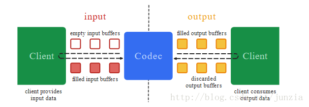

[TOC]


#### 使用MediaPlayer播放一个视频
- 使用MediaPlayer和TextureView实现视频的播放,通过矩阵直接控制TextureView的比例


#### 视频的基础概念:
- 分辨率
- 码流(码率,位速)　数据传输时单位时间传送的数据位数.使用的单位 kbps(千位每秒) ps表示/s(每秒)　单位时间的二进制数据量
- 帧率 每秒钟帧数

#### YUV
- Y 表示亮度,灰度值
- U 表示色度
- V 表示浓度

NV21
YV12
YUV420sp
YUV420(I420)


[图文详解YUV420数据格式](https://www.cnblogs.com/azraelly/archive/2013/01/01/2841269.html)


#### MediaCodec



> 针对于上图，我们可以把InputBuffers和OutputBuffers简单的理解为它们共同组成了一个环形的传送带，传送带上铺满了空盒子。编解码开始后，我们需要得到一个空盒子（dequeueInputBuffer），然后往空盒子中填充原料（需要被编/解码的音/视频数据），并且放回到传送带你取出时候的那个位置上面（queueInputBuffer）。传送带经过处理器（Codec）后，盒子里面的原料被加工成了你所期望的东西（编解码后的数据），你就可以按照你放入原料时候的顺序，连带着盒子一起取出加工好的东西（dequeueOutputBuffer），并将取出来的东西贴标签（加数据头之类的非必须）和装箱（组合编码后的帧数据）操作，同样之后也要把盒子放回到原来的位置（releaseOutputBuffer）。摘自[Android硬编码——音频编码、视频编码及音视频混合](http://blog.csdn.net/junzia/article/details/54018671)


相关方法:
- getInputBuffers() 获取需要编码数据的输入流队列，返回的是一个ByteBuffer数组 
- dequeueInputBuffer(long timeoutUs) 获取可以输入数据的ByteBuffer的索引,阻塞timeoutUs的时间.
- queueInputBuffer(int index, int offset, int size, long presentationTimeUs, int flags)提交数据到解码器 index:指定对应的ByteBuffer的索引,presentationTimeUs:表示当前帧的时间,flags
- dequeueInputBuffer (long timeoutUs) 从解码器的输出队列中获取解码后的ByteBuffer的索引,阻塞timeoutUs微秒的时间

一些注意点：
1. **解码后的ByteBuffer不可以直接操作,并且在数据复制之后清空**
2. **在视频解码之后需要睡眠一定的时间(当前帧的事件戳－解析出来的时间)**


#### MediaCodecList
可以通过这个类获取所有的编解码器,支持的颜色格式和

#### MediaCodecInfo
[MediaCodecInfo](https://developer.android.com/reference/android/media/MediaCodecInfo.html)


#### 流控


#### MP4的编码和解码

#### 从摄像头采集和预览,并添加特效,保存到MP4中.

1. 获取合适的尺寸,设置属性,然后打开相机,根据设置的尺寸通过自定义的一个父View修改 ```GLSurfaceView ```的比例.
2. ```GLSurfaceView```设置```Render```回调,在```onSurfaceCreated```回调方法中进行着色器新建，编译和链接以及着色器程序的链接等初始化工作,新建一个绑定到```GLES11Ext.GL_TEXTURE_EXTERNAL_OES```的纹理,并使用对应的id新建```SurfaceTexture```
3. 通知相机开始预览，通过```Camera.setOnFrameAvailableListener```方法设置回调,并且调用````Camera.setPreviewTexture```设置上面新建的```SurfaceTexture```
4. 在```Camera.setOnFrameAvailableListener```的回调方法中请求绘制.
5. 在```onDrawFrame```中调用opengl相关方法进行绘制
6. 同样在``` onDrawFrame ```中进行视频的录制.通过``` MeidaCodec.createInputSurface()```创建一个Surface,然后在EGL环境初始化中传入，通过把SurfaceTexture这个纹理绘制到这个Surface中，实现摄像头数据的输入,至于额外的特效，就在这个EGL环境中实现.
7. 使用```MediaCodec```实现视频的编码，使用```MediaMuxer```封装H264成MP4

以上的过程涉及到多个线程，一个主线程，一个GLSurfaceView的绘制线程,一个视频编码的线程.

大体的原理就是通过SurfaceTexture作为OpenGL中的一个纹理,分别在GLSurfaceView的绘制线程中添加特效和在录制视频中添加,而录制的数据是通过``` MeidaCodec.createInputSurface()```创建```Surface```,然后通过``` EGL14.eglCreateWindowSurface```方法连接.


#### 从MP4中解码，应用特效，显示在屏幕上.


- [ ]从mp4视频中获取一个截图
- [ ] 

参考文章：
- [MediaCodec API 详解](http://www.cnblogs.com/renhui/p/7478527.html)
###### - [demo](https://github.com/taehwandev/MediaCodecExample/blob/master/src/net/thdev/mediacodecexample/decoder/AudioDecoderThread.java) AAC和H264的解码demo
- [官方文档](https://developer.android.com/reference/android/media/MediaCodec.html)
- [Android硬编码——音频编码、视频编码及音视频混合](http://blog.csdn.net/junzia/article/details/54018671)


