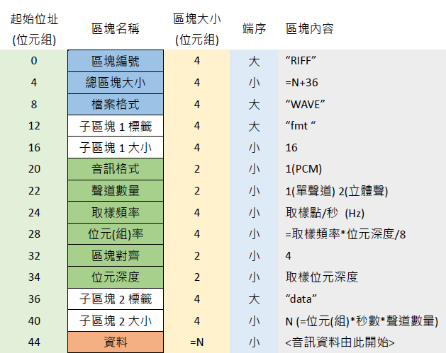

音频相关属性:
- **采样率(samplerate)** 每秒的采样点数量,常用44.1kHz
- **量化精度(位宽)** 8Bit或者16Bit,每个采样的数据用多少位来表示
- **声道数** 多个音频源输出到多个扬声器,单声道（Mono）和双声道（Stereo）比较常见

音频采集: MediaRecoder,AudioRecord
音频播放:SoundPool,MediaPlayer,AudioTrack,(OpenSL ES)
- MediaPlayer功能强大,可以播放音频和视频,但是初始化比较Heavy
- SoundPool 只能播放音频,适用于小段音频的多次重复播放,如游戏音效或者app的点击音效等,支持的特性:

1.设置同时播放声音的最大数.
2.设置不同声音的优先级,到达最大值时会丢弃优先级低的声音
3.暂停和停止声音播放
4.循环播放
5.设置声道
- AudioTrack，最接近硬件层的api,灵活性很高.

**AudioRecoder没有权限时会崩溃**

Wav文件头图解:

### AAC编码(Advanced Audio Coding 高级音频编码)
主要扩展名: .aac/.mp4/.m4a

AAC音频文件格式:
- ADIF 只有一个同一的头,需要得到所有的数据后解码.
- ADTS 每一帧都有头信息,可以任意帧解码.

