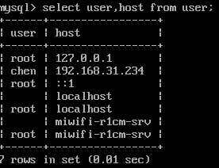

[TOC]
#### mysql安装
##### cenos7.5中安装mysql
```
wget http://repo.mysql.com/mysql-community-release-el7-5.noarch.rpm
rpm -ivh mysql-community-release-el7-5.noarch.rpm
yum update
yum install mysql-server
```

##### 权限设置
```
chown mysql:mysql -R /var/lib/mysql
```

##### 初始化MySQL
```
mysqld --initialize
```

##### 启动MySQL
```
systemctl start mysqld
```

##### 关闭MySQL
```
systemctl stop mysqld
```

##### 查看MySQL的运行状态
```
systemctl status mysqld
```


#### 初始化
##### 设置root密码
Mysql安装成功后，默认的root用户密码为空，你可以使用以下命令来创建root用户的密码：
```
mysqladmin -u root password "new_password";
```

通过以下命令连接数据库：
```
mysql -u root -p

```

##### 新建用户并授权
```
＃表示授予了192.168.0.111从远程用root用户名和123456密码对所有数据库所有表的所有权限
GRANT ALL PRIVILEGES ON *.* TO root@'192.168.0.111' IDENTIFIED BY '123456' WITH GRANT OPTION;

#表示授予了所有外来的IP从远程用myuser用户名和pass密码对demo数据库下的所有表的所有权限
GRANT ALL PRIVILEGES ON demo.* to 'myuser'@'%' IDENTIFIED BY 'pass' WITH GRANT OPTION;

＃表示授予了本机中的用户keke和haha密码对user数据库下的所有表的所有权限
GRANT ALL PRIVILEGES ON user.* to 'keke'@'localhost' IDENTIFIED BY 'haha' WITH GRANT OPTION; 

```
- ALL PRIVILEGES 表示所有的权限 全部权限[查看](https://dev.mysql.com/doc/refman/5.5/en/privileges-provided.html)
- ＊.＊ ．之前表示数据库，*表示全部，.之后表示数据表
- @'%' %表示所有的外来IP,localhost表示本地主机，％并不包括localhost

==注意:调用以下命令，方可即时刷新权限，或者重启数据库==
```
FLUSH PRIVILEGES;
```
新增用户之后可以使用以下命令（mysql数据库下的user表）
```
use mysql;
select user,host from user;
```


#### 数据类型

##### NUMERIC

```
DECIMAL(5,2) # 表示最大5位，且小数点2位，取值范围为-999.99到999.99
```
- FLOAT 　4个字节
- DOUBLE　８个字节

整形的类型支持在定义时后添加位数，如
```
INT(4)
```
这仅仅是用于标记，并不会对实际存放数据的范围有影响.

unsigned:
- 所有的INTEGER类型都可以用unsigned修饰，所保存的正数范围都会加倍
- FLOAT,DOUBLE和DECIMAL都可以用unsigned修饰，但保存的数据范围并不会发生改变.

##### Date＆Time类型

| 数据类型 | 默认值 |返回格式|保存值范围|
|--------|--------|--------|--------|
|   DATE     |  '0000-00-00'      |'YYYY-MM-DD'|'1000-01-01'-'9999-12-31'|
|   TIME     |     '00:00:00'   |　'HH:MM:SS'| '-838:59:59' to '838:59:59'|
|   DATETIME     |    	'0000-00-00 00:00:00'     |'YYYY-MM-DD HH:MM:SS'|'1000-01-01 00:00:00'-'9999-12-31 23:59:59'|
|   TIMESTAMP     |'0000-00-00 00:00:00'||'1970-01-01 00:00:01' UTC-'2038-01-19 03:14:07' UTC|
|   YEAR     |      	0000   |


两位数字的YEAR转换的规则:
- 70-99就会转换成1970-1999
- 00-69就会转换成2000-2069

###### DATE,DATETIME,TIMESTAMP

开启ALLOW_INVALID_DATES模式，还可以存储一些非法日期，如2019-02-30,此时对于日期MySQL只校验月份是不是1-12,日期是不是1-31.

DATE和DATETIME类型的日跟月份都可以保存0值，如：＇2019-00-00＇ '2019-01-00'.开启NO_ZERO_IN_DATE模式关闭保存0值

MuSQL可以保存'0000-00-00'这个0值，开启NO_ZERO_DAT模式就可以禁止这个值保存


TIMESTAMP在数据库中会保存世界时(UTC),获取时会返回对应的时区的时间，所以使用TIMESTAMP要注意时区的问题
TIMESTAMP类型提供了自动更新功能[TODO](https://dev.mysql.com/doc/refman/5.5/en/timestamp-initialization.html)
非法的DATE,DATETIME,TIMESTAMP的值会被转化成0值．


###### TIME类型
TIME类型的范围超过24小时是因为TIME类型还可以用来保存两个时间点之间的时间间隔.

###### YEAR类型
YEAR仅仅占用一个字节

###### TIMESTAMP类型
TIMESTAMP提供自动初始化和更新为当前时间．
- 只要任何一列有改变，TIMESTAMP类型的列就会自动更新为当前时间．除非用户手动设置TIMESTAMP列的值．
- 如果其他列没有改变，却想改变TIMESTAMP的值，可以手动设置为CURRENT_TIMESTAMP

| 当前时间的获取方式 |
|--------|
|  NOW() |
|  CURRENT_TIMESTAMP() |
|  CURRENT_TIMESTAMP |
|  LOCALTIME() |
|  LOCALTIME |
|  LOCALTIMESTAMP |
|  LOCALTIMESTAMP() |

创建TIMESTAMP类型时的修饰语句
- DEFAULT CURRENT_TIMESTAMP 设置默认值为当前时间
- ON UPDATE CURRENT_TIMESTAMP　更新时自动更新为当前时间

添加这两个修饰语句跟默认的方式都表示默认和更新时自动更新为当前时间
```sql
CREATE TABLE t1 (
  ts TIMESTAMP DEFAULT CURRENT_TIMESTAMP ON UPDATE CURRENT_TIMESTAMP
);

CREATE TABLE t1 (
  ts TIMESTAMP
);
```

关于TIMESTAMP的值为NULL
- 如果TIMESTAMP指定为NOT NULL(没有明确指定为NULL或者指定了默认值),那么当TIMESTAMP的值为NULL时，MySQL会设置当前列的值为当前时间.
- 如果TIMESTAMP可为NULL,且设置了默认值，那么如果TIMESTAMP的值为NULL,MySQL会把当前列的值为NULL,但设置了默认值的话，那么值就是默认值.

关于时间类型之间的转换
- DATE转DATETIME或者TIMESTAMP,仅仅添加'00:00:00',DATE转TIME，not work,值都是'00:00:00'
- DATETIME或者TIMESTAMP转DATE就把时分秒去掉，转TIME就把年月日去掉.


##### STRING类型


#### 增删改查

***

#####　INSERT
语法:
```sql
INSERT INTO tb_name VALUES　(列0值,列1值,列2值,...);#值的顺序跟列顺序一致
INSERT INTO tb_name (列1,列2,...) VALUES [(值1,值2,值3,...),(值1,值2,值3,...),...]; 

INSERT INTO tb_name SET assignment_list;

#用查询结果填充新的行
INSERT INTO tb_name (列1,列2,...) SELECT ...;

＃以上所有的模式末尾都可添加,表示在插入的列中如果是唯一的，且插入的值表中已有，就仅仅更新ON DUPLICATE KEY UPDATE后指定的值，否则就是插入操作.
ON DUPLICATE KEY UPDATE assignment_list
```

eg:
```sql
INSERT INTO Persons (LastName,Address) VALUES ('JSLite','ShangHai');

INSERT INTO meeting SET a=1,b=3;

#从meeting表中查询数据插入到orders表中.
INSERT INTO orders (user_account_id,title) SELECT m.user_id,m.title FROM meeting m where m.id=1;

# 插入多行数据
INSERT INTO tbl_name (a,b,c) VALUES(1,2,3),(4,5,6),(7,8,9);
```

###### 关于默认值
1. 隐含默认值：各个数据类型都有的默认值，如数据类型的隐含默认值为0,字符串类型的隐含默认值为空字符串，更多[请看](https://dev.mysql.com/doc/refman/5.5/en/data-type-defaults.html)
2. 指定默认值：指的是在创建数据表的语句中DEFAULT value的这个值.
---
- 插入时不指定列和值
```sql
INSERT INTO tbl_name () VALUES();
```
在不同的模式下，有不同的行为:在strict模式下,如果有列没有指定默认值，MySQL就会报错，而在关闭strict模式下,MySQL会给没有指定默认值的列，使用隐含默认值.

- 使用DEFAULT()函数获取指定默认值 
```sql
DEFAULT(col_name)
INSERT INTO t SET i = DEFAULT(i)+1;
```

###### expr表达式
*expr*表示式指的是在指定值的时候，可以使用在当前列之前声明的列名a获取a列的值．**例外的是如果一个列是AUTO_INCREMENT的，那么这一列是不可以引用的，因为AUTO_INCREMENT是最后进行运算的,如果引用了返回0**
```
INSERT INTO tbl_name (col1,col2) VALUES(15,col1*2);
```
最后赋值的col1＊2就是*expr*. 

---
expr的类型转换,在使用expr的时候，有可能会使用到不同的类型，此时就会涉及到类型转换.

例如，插入字符串'1999.0e-2'到INT,FLOAT,DECIMAL(10,5),YEAR,各自插入的值是1999,19.9921,19.99210,1999
**转换的规则：**
- string TO number(INT,YEAR) 只会把字符串中最前面看似是数字的转换
- string TO number(FLOAT,DECIMAL)会考虑整个字符串的值

***


#### 解决问题
可以尝试telnet来查看端口号是否正常.
- [因为防火墙的关系没办法连接上mysql](https://blog.csdn.net/u013257111/article/details/79063578)


参考：
- [安装](http://www.runoob.com/mysql/mysql-install.html)
- [21分钟MySQL基础入门](https://github.com/jaywcjlove/mysql-tutorial/blob/master/21-minutes-MySQL-basic-entry.md#%E5%A2%9E%E5%88%A0%E6%94%B9%E6%9F%A5)
- [官方文档](https://dev.mysql.com/doc/refman/5.5/en/)
	


