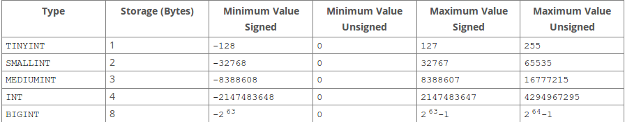

[TOC]
#### 数据类型

##### NUMERIC

```sql
DECIMAL(5,2) # 表示最大5位，且小数点2位，取值范围为-999.99到999.99
```
- FLOAT 　4个字节
- DOUBLE　８个字节

整形的类型支持在定义时后添加位数，如
```sql
INT(4)
```
这仅仅是用于标记，并不会对实际存放数据的范围有影响.

unsigned:
- 所有的INTEGER类型都可以用unsigned修饰，所保存的正数范围都会加倍
- FLOAT,DOUBLE和DECIMAL都可以用unsigned修饰，但保存的数据范围并不会发生改变.

##### Date＆Time类型

| 数据类型 | 默认值 |返回格式|保存值范围|
|--------|--------|--------|--------|
|   DATE     |  '0000-00-00'      |'YYYY-MM-DD'|'1000-01-01'-'9999-12-31'|
|   TIME     |     '00:00:00'   |　'HH:MM:SS'| '-838:59:59' to '838:59:59'|
|   DATETIME     |    	'0000-00-00 00:00:00'     |'YYYY-MM-DD HH:MM:SS'|'1000-01-01 00:00:00'-'9999-12-31 23:59:59'|
|   TIMESTAMP     |'0000-00-00 00:00:00'||'1970-01-01 00:00:01' UTC-'2038-01-19 03:14:07' UTC|
|   YEAR     |      	0000   |


两位数字的YEAR转换的规则:
- 70-99就会转换成1970-1999
- 00-69就会转换成2000-2069

###### DATE,DATETIME,TIMESTAMP

开启ALLOW_INVALID_DATES模式，还可以存储一些非法日期，如2019-02-30,此时对于日期MySQL只校验月份是不是1-12,日期是不是1-31.

DATE和DATETIME类型的日跟月份都可以保存0值，如：＇2019-00-00＇ '2019-01-00'.开启NO_ZERO_IN_DATE模式关闭保存0值

MuSQL可以保存'0000-00-00'这个0值，开启NO_ZERO_DAT模式就可以禁止这个值保存


TIMESTAMP在数据库中会保存世界时(UTC),获取时会返回对应的时区的时间，所以使用TIMESTAMP要注意时区的问题
TIMESTAMP类型提供了自动更新功能[TODO](https://dev.mysql.com/doc/refman/5.5/en/timestamp-initialization.html)
非法的DATE,DATETIME,TIMESTAMP的值会被转化成0值．


###### TIME类型
TIME类型的范围超过24小时是因为TIME类型还可以用来保存两个时间点之间的时间间隔.

###### YEAR类型
YEAR仅仅占用一个字节

###### TIMESTAMP类型
TIMESTAMP提供自动初始化和更新为当前时间．
- 只要任何一列有改变，TIMESTAMP类型的列就会自动更新为当前时间．除非用户手动设置TIMESTAMP列的值．
- 如果其他列没有改变，却想改变TIMESTAMP的值，可以手动设置为CURRENT_TIMESTAMP

| 当前时间的获取方式 |
|--------|
|  NOW() |
|  CURRENT_TIMESTAMP() |
|  CURRENT_TIMESTAMP |
|  LOCALTIME() |
|  LOCALTIME |
|  LOCALTIMESTAMP |
|  LOCALTIMESTAMP() |

创建TIMESTAMP类型时的修饰语句
- DEFAULT CURRENT_TIMESTAMP 设置默认值为当前时间
- ON UPDATE CURRENT_TIMESTAMP　更新时自动更新为当前时间

添加这两个修饰语句跟默认的方式都表示默认和更新时自动更新为当前时间
```sql
CREATE TABLE t1 (
  ts TIMESTAMP DEFAULT CURRENT_TIMESTAMP ON UPDATE CURRENT_TIMESTAMP
);

CREATE TABLE t1 (
  ts TIMESTAMP
);
```

关于TIMESTAMP的值为NULL
- 如果TIMESTAMP指定为NOT NULL(没有明确指定为NULL或者指定了默认值),那么当TIMESTAMP的值为NULL时，MySQL会设置当前列的值为当前时间.
- 如果TIMESTAMP可为NULL,且设置了默认值，那么如果TIMESTAMP的值为NULL,MySQL会把当前列的值为NULL,但设置了默认值的话，那么值就是默认值.

关于时间类型之间的转换
- DATE转DATETIME或者TIMESTAMP,仅仅添加'00:00:00',DATE转TIME，not work,值都是'00:00:00'
- DATETIME或者TIMESTAMP转DATE就把时分秒去掉，转TIME就把年月日去掉.


##### STRING类型
###### CHAR和VARCHAR
- CHAR类型:指定的长度就是保存的长度，如果保存的内容不足指定的长度，就会用空格右边填充完整.从MySQL中获取的时候就会删除填充的空格.除非开启[PAD_CHAR_TO_FULL_LENGTH](https://dev.mysql.com/doc/refman/5.5/en/sql-mode.html#sqlmode_pad_char_to_full_length)模式.指定长度为0-255.
- VARCHAR类型:可变长度字符串，指定的长度为最大长度.会使用1到2个字节存储字符串的字节数,小于255个字节使用一个字节保存，多余255就是用2个字节保存.[关于最大值TODO](https://dev.mysql.com/doc/refman/5.5/en/column-count-limit.html)

| 需要保存的值 | CHAR(4)保存的值 | 保存需要的字节 | VARCHAR(4)保存的值 |保存需要的字节 |
|--------|--------|--------|--------|--------|
|   ''     |   '&nbsp;&nbsp;&nbsp;&nbsp;'     |  4      |   ''     |     1   |
|    'ab'    | 'ab&nbsp;&nbsp;'    |    4    |   'ab'     |     3(字节数占一个字节)  |
|   'abcd'     | 'abcd'     |  4      |   'abcd'     |   5 (字节数占一个字节)    |
|   'abcdefgh'     |  'abcd' |  4     |  'abcd'      |   5 (字节数占一个字节)    |

最后一行如果在strict模式中，就会报错.

==注意：CHAR类型的数据如果结尾为空白，那么获取的时候会被删除掉，丢失掉原来的数据==

###### ENUM
枚举类型的优点:
- 保存的数据会优化成数字，减少空间的占用
- 保存和获取的数据都是枚举的字面字符串，增加可读性。

枚举类型的缺点：
- 在建表中ENUM列定义中不可以使用CONCAT函数
- 在建表中ENUM列定义中不可以使用变量


创建ENUM类型的列
```sql
CREATE TALBE shirts(
	name VARCHAR(40),
    size ENUM('x-small','small','medium',large','x-large')
);
```
以上创建的size列，保存在MySQL中的值如下：

| 字面值 | 保存在MySQL的值 |
|--------|--------|
|    NULL    |   NULL     |
|    ''    |   0     |
|    'x-small''    |   1    |
|    'small'    |   2     |
|    'medium'    |   3     |
|    'large'    |   4     |
|    'x-large'    |   5     |

在查询中可以通过以下方式获取实际保存的值（即1,2,3...）等
```sql
 SELECT enum_col+0 FROM tbl_name;
```
同样例如SUM()和AVG()等函数可以将ENUM类型的值强转成对应保存的值.

- 如果插入不在枚举列表中的值，MySQL会把值替换成空字符串，对应保存的值就会是0.但在strict模式中，就会报错.
- 如果ENUM允许为NULL,则默认值为NULL,如果ENUM不允许，即NOT NULL,默认值为枚举列表中的第一个值.
- 建议定义枚举列表顺序根据自然顺序，因为当使用order by ENUM的时候，排序根据NULL->0->ENUM列定义的顺序

==在枚举中不可以定义相同的值，在strict模式中就会报错==

预想的场景：保存性别，

###### SET类型
创建SET类型的列：
```sql
CREATE TALBE shirts(
	name VARCHAR(40),
    hobby SET('football','basketball')
);
```
那么可能的值如下:
```sql
''
'football'
'basketball'
'football,basketball'
```

跟ENUM一样，保存的值并不是定义的值，而是数字，如果SET('a','b','c','d'),那么：

| 元素 | 十进制数字值 | 二进制的值|
|--------|--------|--------|
|   'a'     |   1     |	 0001  |
|   'b'     |    2    | 0010	|
|   'c'     |     4   | 0100	|
|   'd'     |      8  |	1000   |
这里仅仅列出单个值的情况，最终可能有0-15共16个值，例如：'a,d'的值就是9,对应的二进制就是1001

- 无论插入数据表时SET的元素顺序如何，最终获取的时候会返回定义时的顺序．
- 无论插入数据表时单个SET的元素出现次数多寡，最后获取的时候仅仅返回一个．
- 排序的顺序为NULL->数字值的顺序

```sql
CREATE TABLE myset (col SET('a', 'b', 'c', 'd'));
INSERT INTO myset (col) VALUES ('a,d'), ('d,a'), ('a,d,a'), ('a,d,d'), ('d,a,d');
SELECT col FROM myset;
+------+
| col  |
+------+
| a,d  |
| a,d  |
| a,d  |
| a,d  |
| a,d  |
+------+
5 rows in set (0.04 sec)
```

查询方式:
```sql
# 查找所有set_col_name中包含football的行
SELECT * FROM tb_name WHERE FIND_IN_SET('football',set_col_name)>0;

# 查找所有set_col_name中包含football的行，这里进行的是模糊搜索,可以会比上面的查询包含多一些结果
SELECT * FROM tb_name WHERE set_col_name　LIKE '%football%'

＃查询值等于'val1,val2'的行，注意元素的顺序需要跟定义SET时保持一致，否则将查询不到对应的结果
SELECT * FROM tbl_name WHERE set_col = 'val1,val2';
```
==定义的元素中不要含有逗号,也不要重复==

预想场景：保存多选项，

参考:
- [官方文档-数据类型](https://dev.mysql.com/doc/refman/5.7/en/data-types.html)