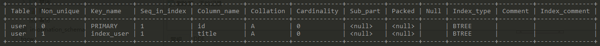
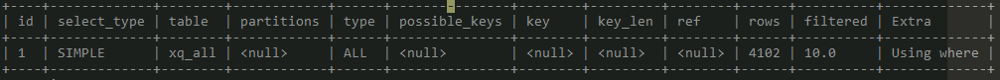

<!-- MarkdownTOC -->

- [索引的增删](#索引的增删)
- [索引的分类](#索引的分类)
    - [普通索引](#普通索引)
    - [唯一索引](#唯一索引)
    - [主键索引](#主键索引)
    - [组合索引](#组合索引)
    - [FULLTEXT索引](#fulltext索引)
- [索引的创建](#索引的创建)
- [索引的查看](#索引的查看)
- [索引的删除](#索引的删除)
- [EXPLAIN命令](#explain命令)

<!-- /MarkdownTOC -->


### 索引的增删

### 索引的分类

#### 普通索引
最基本的索引
```sql
CREATE INDEX index_name ON table(colunm(length))
```

#### 唯一索引
索引列的值必须唯一，允许有空值
```sql
CREATE UNIQUE INDEX index_name ON table(column(length))
```

#### 主键索引
主键的索引,不允许有值,InnoDb类型引擎的表创建的同时会创建主键索引,名称为PRIMARY
```SQL
CREATE TABLE `table` (
    `id` int(11) NOT NULL AUTO_INCREMENT ,
    `title` char(255) NOT NULL ,
    PRIMARY KEY (`id`)
);
```

#### 组合索引
多个列组成的索引,组合索引遵循最左前缀原则，最多包含16个列
```sql
CREATE INDEX index_name ON table(colunm1(length1),colunm2(length2)...)
```

#### FULLTEXT索引
用于全文搜索,只有InnoDB和MyISAM存储引擎支持，仅适用于CHAR,VARCHAR和类型.并不支持列前缀索引

### 索引的创建
- 建表的同时进行索引的添加
```sql
CREATE TABLE `user` (
    `id` int(11) NOT NULL AUTO_INCREMENT ,
    `title` char(255) NOT NULL ,
    `content` text NULL ,
    `time` int(10) NULL DEFAULT NULL ,
    PRIMARY KEY (`id`),
    # 创建index_name名称的索引,并指定为title且长度为length
    INDEX index_name (title(length))
)
```

- 直接创建索引
```sql
CREATE INDEX index_name ON tb_name (column_list)
CREATE UNIQUE INDEX index_name ON tb_name (column_list)
```

- 修改表格时创建
```sql
ALTER TABLE tb_name ADD [UNIQUE,FULLTEXT,INDEX] index_name (column_list)
```

### 索引的查看
```sql
SHOW INDEX FROM tb_name FROM db_name
```
返回的信息：

- Table 表名
- Non_unique 0表示唯一 1表示并不唯一
- Key_name 索引名称
- Seq_in_index 在索引中的排序，从１开始 ????
- Column_name 列名
- Collation 索引中列的排列方式　A表示ASC,NULL表示没有排序
- Cardinality 索引中唯一值的估算数量
- Sub_part 索引前缀　指定的部分索引的长度或者为NULL,NULL表示整列作为索引
- Packed 表示索引如何打包　????
- NULL 如果索引包含NULL值，则为YES，否则为''
- Index_type 索引的数据结构[BTREE,FULLTEXT,HASH,RTREE]
- Comment 列的注释内容
- Index_comment 创建索引时的注释内容

### 索引的删除
```sql
DROP INDEX index_name ON tb_name
```


### EXPLAIN命令

查看是否使用了建立的索引，可以使用EXPLAIN命令来查看对应的查询语句.如下：
```sql
EXPLAIN SELECT 查询语句
```
获得的结果:
- select_type SELECT的类型 如 SIMPLE,PRIMARY,UNION等
- table 查询的表名
- type ```join type```

```sql
以下从性能最优到最差排序 
system > const > eq_ref > ref > fulltext > ref_on_null > index_merge > unique_subquery > index_subquery > range > index > ALL
```
- possible_keys 可能使用到的索引,如果为NULL,表示没有相关索引.
- key 表示MySQL实际会用到的索引.如果为NULL,表示没有可用的索引
- key_len 表示使用的索引的长度(组合索引用到的长度)
- ref 跟key一起的字段或者常数 ???
- rows 表示估算的要遍历的数据行数.越小越好
- filtered 表示过滤的数据占表数据的百分比
- Extra 表示MySQL怎么去解析这个查询

[mysql索引攻略](https://www.cnblogs.com/nixi8/p/4574709.html)
[MySQL的索引是什么？怎么优化？](https://my.oschina.net/liughDevelop/blog/1788148)
[官方文档-EXPLAIN命令](https://dev.mysql.com/doc/refman/5.5/en/explain-output.html#explain_possible_keys)


- 单列索引的数据结构是B+Tree,那么组合索引的数据结构是如何？多列索引的数据结构？
- 主索引?　辅助索引?　我的判断主键索引就是主索引，其他索引为辅助索引
- 判断select语句是否使用了索引
- 为何组合索引是最左前缀的原则,在数据结构上如何体现
- NOT NULL索引为何比允许为NULL优？

[MySQL索引背后的数据结构及算法原理](http://blog.codinglabs.org/articles/theory-of-mysql-index.html)
[美团](https://tech.meituan.com/2014/06/30/mysql-index.html)
[](https://juejin.im/post/5a6873fbf265da3e393a97fa)


