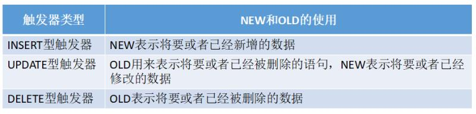

[TOC]

#### 触发器
##### 触发器是什么
针对特定的表在数据发生变化时触发的操作，例如：在用户表上定义一个触发器，当用户表插入数据时，就会在日志表中插入一条数据.

##### 语法
- 创建触发器的语法：
```
CREATE TRIGGER trigger_name BEFORE|AFTER INSERT|DELETE|UPDATE ON tb_name FOR EACH ROW trigger_cmd
trigger_name:触发器的名称
tb_name:监听的表名
FOR EACH ROW:表示每一行的变化都会触发之后的程序
trigger_cmd:一条SQL语句
```
eg:
```
CREATE TRIGGER helloworld BEFORE ADD
ON users FOR EACH ROW
INSERT INTO logs VALUES(NOW());
```

- 创建多条语句的触发器语法:
```
CREATE TRIGGER trigger_name BEFORE|AFTER 事件
ON 表名 FOR EACH ROW
BEGIN
	多条语句
END
```
由于BEGIN 和END之间的语句用分号结束,同时触发器创建语句也是分号结束，此时需要使用DELIMITER替换结束符 **记住在创建完成之后需要将结束符替换回分号**
eg:
```
DELIMITER &
CREATE TRIGGE helloworld BEFORE ADD
ON users FOR EACH ROW
BEGIN
INSERT INTO logs VALUES(NOW());
INSERT INTO logs VALUES(NOW());
END
&
//创建完成
DELIMITER ;
//恢复结束符为;
```

- BEGIN...END之间的语法
可以定义变量,但只限于内部使用
```
DECLARE var_name var_type [DEFAULT value] //定义变量 类型 甚至指定默认值
SET var_name=value //给变量赋值
```
  - 内置的变量NEW和OLD的使用
  ```
  NEW.columnname：新增行的某列数据
  OLD.columnname：删除行的某列数据
  ```



##### 触发器相关命令
- 查看触发器信息
```
SHOW TRIGGERS;
```

- 查看指定的触发器信息
```
SELECT * FROM information_schema.triggers WHERE TRIGGER_NAME='trigger_name';
```

- 删除指定触发器
```
DROP TRIGGER trigger_name;
```

##### 注意
==不推荐使用==
原因：
- 触发器隐式调用，不容易被察觉
- 高并发的应用中，会有性能问题
- 可移植性问题 mysql迁移到oracle


参考
- [mysql触发器trigger 实例详解](https://www.cnblogs.com/phpper/p/7587031.html)
- [不使用的看法](https://segmentfault.com/q/1010000004907411)
- [MySQL触发器trigger的使用](https://www.cnblogs.com/geaozhang/p/6819648.html)
- [官方文档](https://dev.mysql.com/doc/refman/5.5/en/triggers.html)